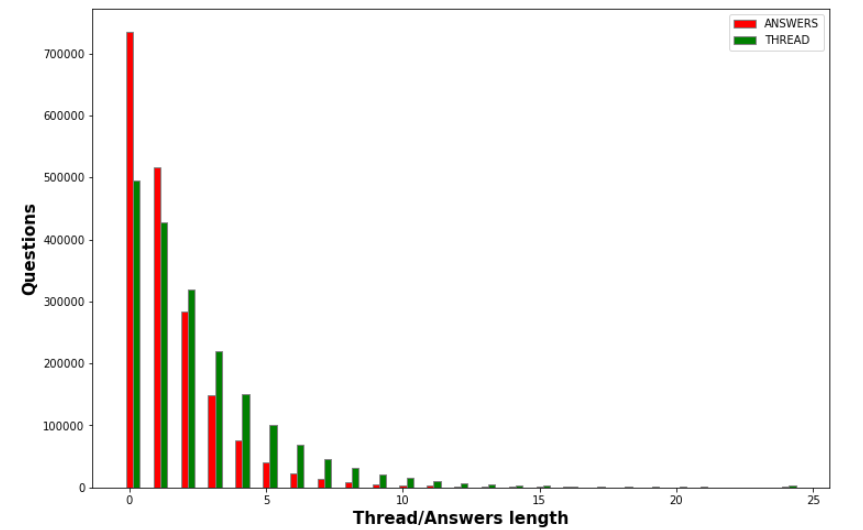
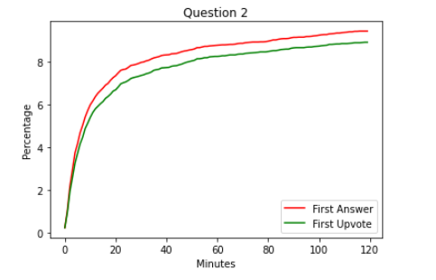
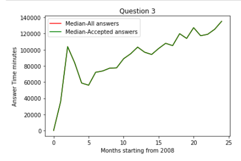
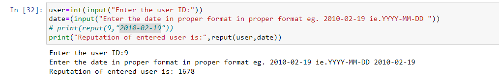

# StackOverFlowQA_Analysis  
## Description 
This paper is aimed at analysis of question answer site ‘Stack Overflow’. This analysis is aimed at finding out why stack overflow achieved and maintained its reputation in
programming question and answer forums. This analysis will provide a deeper
understanding of discrepancy of the expert user and new users
along with analysis of its working over the years from 2008 to
2010.

## Table of Contents

1. [Running Steps](#Running_Steps)
2. [Questions](#Questions)
5. [Acknowledgements](#Acknowledgements)
6. [Support](#Support)
7. [License](#License)
8. [Project Status](#Project-Status)

## Running_Steps
### Environment Needed
-Python V3
-Jupyter Notebook
-Pandas

### Running Steps
tep 1: After setting the environment make sure that csv files and the ipynb files are in same folder. Step 2: Open the file of the question you wish to run
Step 3: Run the snippets from top to down for the respective questions to get 

## Questions
### QUESTION 1 : What is the distribution of answers and thread lengths for all the questions?

### Question 2 : How long do users wait to recieve answers?

### Question 3: How did this rapid answer time emerge over the site's history?

### Question 4: Which tags are associated with fast and slow response time?

### Question 5: How to calculate reputation of users?

## Acknowledgements
I would like to express my gratitude to Lakehead University for providing me with an opportunity to do this research. I would also like to express my thanks to Dr. Trevor Tomesh for guiding me through my journy of writing this research paper and help me get better understanding of github and its uses.

## License
This is open source project. Though it would be nice to give me message if find this project useful for your needs.

## Support
Feel free to contact me in case code has bugs. In fact I will very much appreciate for finding the faults in the code. Feel free to reach out to me. Though emails are the fastest ones I reply.

## Project-Status
Project is still under development but on hold for indefinate amount. Would be great if anyone wants to collaborate for this. Just drop a message

Connect: Yash Atul Patel  

Contact: yash9132@gmail.com
